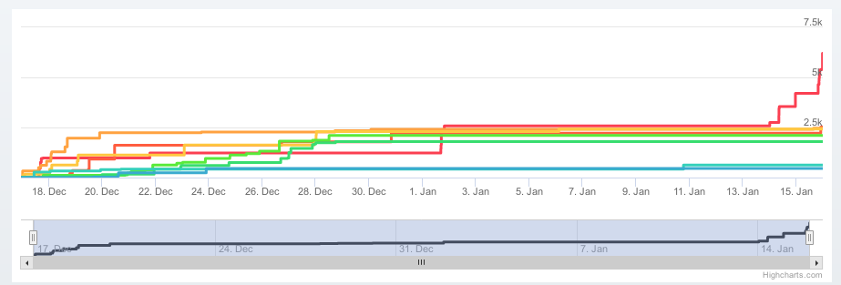
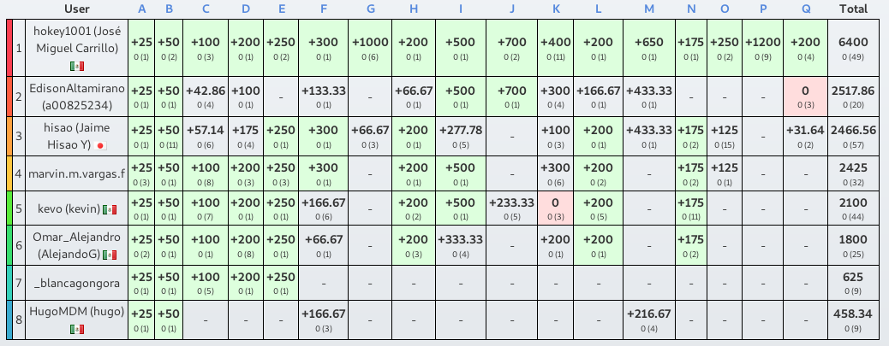

# Los desafíos de Juanito

Los desafíos de Juanito es un concurso de 16 problemas de programación, en su mayoría originales, hecho con el objetivo del aprendizaje en los temas de Matemáticas, Física, Robotica y Programación. En este concurso participaron ocho integrantes del Club de Robotica Lions y el ganador logró conseguir todos los puntos.

Lista de temas:
Algebra
Geometría
Algebra Lineal
Series
Razones de cambio
Trigonometría
Vectores
Campos electricos
Centros de masa
Programación orientada a objetos
Complejidad algoritmica
Compuertas lógicas
Mapas
Ordenamientos
Busquedas
Estructuras de datos basicas
Grafos

Autores: James Scoon y Pablo César Ruíz

